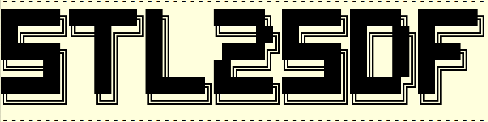

<!--- the logo -->

## Setup the virtual environment
- Install virtual environment [See https://packaging.python.org/en/latest/guides/installing-using-pip-and-virtual-environments/]  
`python3 -m pip install --user virtualenv`
- Create the virtual environment for a specific python version .and. say yes to the prompt question    
`python3 -m venv <pathtosave>/stl2sdf`
- Install the required libraries  
`pip install -r requirements.txt`

To deactivate the special python environment use [Note: dont do this if you wish to run the code...]   
`deactivate`

## Running the code

- Running in parallel [using concurrent.futures]    
`python generateSDF.py 'input-file' 'output-array-location' nprocs `  

`input-file`: String with the location and name of the input file    
`output-array-location`: String with the location to save the numpy arrays with SDF  
`<nprocs>`: Number of processors    

- Running in parallel [Truly MPI]  
`mpirun -np <nprocs> python -m mpi4py generateSDFmpi.py`

The `generateSDFmpi.py` file is setup to run an example with a spehere in the domain. Additionally, the `multi_sphere.stl` example can also be used to understand the workflow. To run the example using concurrent futures style multithreading use the `runall.sh` script. To run the example using truly MPI based parallelisation use the `runall_mpi.sh` script.

## User input parameters

options:
  -h, --help            show this help message and exit  
  --infile INFILE       Input STL/OBJ file   | Default 'assets/sphere.stl'  
  --filename FILENAME   Target mesh folder   | Default 'assets'  
  --nsamples NSAMPLES   Number of sampling points used to compute the SDF | Default '1000000'  
  --writeData WRITEDATA Flag to write SDF to files | Default 'True'  
  --clipSDF CLIPSDF     Flag to clip the SDF computation at zmax | Default 'False'. 

## Documentation

You can find the documentation [here](./docs/README.md).

### NOTE: The code decomposes in the streamwise direction. Forced to use `nprocs` such that `Nx%nprocs == 0`    

## Code Scaling Tests
Check `docs/scaling.md` for full details of the scaling.

For a case with 2 Billion grid points, the expected peak memory usage is around 150 GB [approx.]. These tests were carried out a rather large stl file. We have observed that for stl files larger than 2 GB, the memory requirements can increase quite rapidly. Thus, we recommend using around 32 processors for these cases such that the total memory requirement stays bounded below 160 GB [relatively realistic limit!]

Signed distance field generated using a typical Large-Eddy-Simulation grid using the `windAroundBuildings` geometry supplied as part of the OpenFOAM tutorials.

  
------------------------------------------------------------------------------------------------------------------------------    

## Compatibilty with non CaNS solvers
While the code is setup to work consistently with CaNS [and staggered grid layout], porting the code to adapt to any other solver is straightforward. Follow the steps below:
1. In `generateSDF.py`, comment load grid portion of the code and load the x,y, and, z grid arrays as numpy arrays. This can be done a forced typecasting such as np.array(<listname>,dtype=np.float64).
2. Additionally, if you would like to output the SDF in a different format, you can edit the numpy2CaNSarray.py file. Beware: Python is not a strongly-typed language so you will need to force the precision of write!

## Contributing to the project

We welcome contributions from everyone!

**Making Changes:** Please fork the repository, create a branch off of `main`, and submit a pull request with your changes for review.

**Found a Bug or Error?** If you discover any bugs in the code or errors in the documentation, open a [new issue](https://github.com/AkshayPatil1994/stl2sdfMPI/issues) with as much information as possible, especially steps to reproduce the bug.

**Questions or Suggestions:** For any queries or ideas, don't hesitate to open an issue.

------------------------------------------------------------------------------------------------------------------------------
This code was written while listening to `Leprous`. Recommended albums `Aphelion [2021]`, `Coal [2013]`, and `Bilateral [2011]`.    

